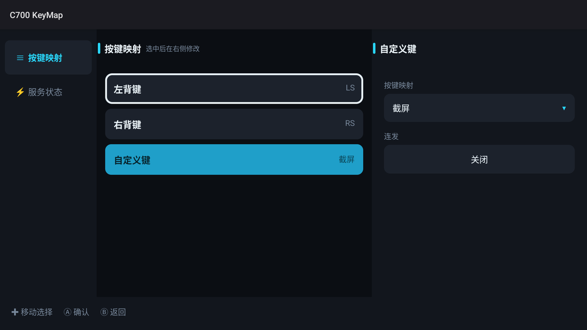
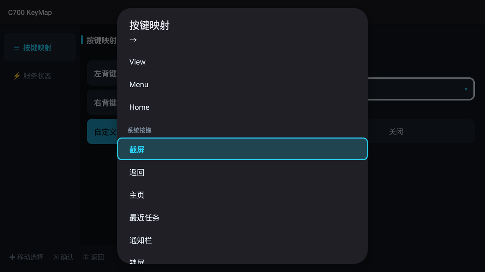
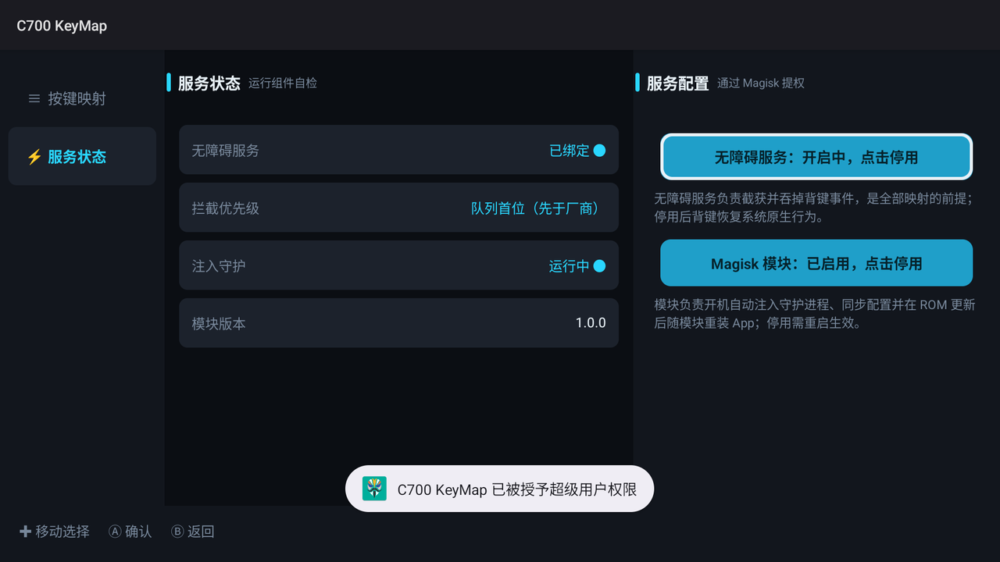

# C700 KeyMap

联想 C700 掌机的左背键、右背键、自定义键映射工具，以 Magisk 模块和配套应用的形式提供。

默认映射：

```
左背键   -> LS
右背键   -> RS
自定义键 -> 截屏
```

## 功能

- 三颗扩展键可映射为手柄按键、系统按键，或设为不映射（保持厂商原本行为）
- 手柄按键以 Xbox 手柄设备身份注入
- 连发，频率 1–30 次/秒
- 横屏界面，支持手柄与触摸操作
- 配置在应用内修改，保存后立即生效，无需重启

## 环境要求

- 联想 C700（LCGHCC700，MediaTek MT6878，Android 16）
- Magisk（root）

设备需已解锁 Bootloader 并装好 Magisk。
不使用 root 时仅支持截屏这类系统动作，手柄按键注入不可用。

## 下载

二进制在 Releases 页面：

- Magisk 模块包：https://github.com/revelation-7/c700-keymap/releases/download/v1.0.0/c700-keymap-v1.0.0.zip
- 独立应用：https://github.com/revelation-7/c700-keymap/releases/download/v1.0.0/c700-keymapd-v1.0.0.apk
- 校验和：https://github.com/revelation-7/c700-keymap/releases/download/v1.0.0/SHA256SUMS.txt

## 安装

### Magisk 模块（推荐）

```bash
adb push c700-keymap-v1.0.0.zip /data/local/tmp/
adb shell su -c "magisk --install-module /data/local/tmp/c700-keymap-v1.0.0.zip"
adb reboot
```

重启后模块会安装应用、启动注入进程，并把本应用的无障碍服务置于系统列表首位。
首次启动会写入默认配置，此后应用内修改的配置不会被覆盖。

模块内已包含应用，刷入后不需要再单独安装 APK。

如果更新模块后背键没有反应，再重启一次即可恢复。

### 不使用 Magisk（仅安装 APK）

```bash
adb install -r c700-keymapd-v1.0.0.apk
```

安装后在应用「服务状态」页启用无障碍服务。这种方式没有 root 权限，只能映射截屏这类系统动作。

## 使用

界面分三栏：左侧页面切换，中间按键列表，右侧设置。手柄与触摸均可操作。



手柄操作（触摸直接点选即可）：

| 按键 | 功能 |
| --- | --- |
| 十字键 / 左摇杆 | 移动光标 |
| A | 确认 |
| B | 返回上一栏，在左栏时退出 |
| 左 / 右方向键 | 在三栏之间切换 |

光标位于中间栏时按 A 进入该按键的编辑区；光标位于值框时按 A 打开目标按键列表。



「服务状态」页显示无障碍服务、拦截优先级与注入守护的运行情况，并可启停无障碍服务与模块：



可选的映射目标：

- 手柄按键：A、B、X、Y、LB、RB、LT、RT、LS、RS、十字键、View、Menu、Home
- 系统按键：截屏、返回、主页、最近任务、通知栏、锁屏、音量加减、静音
- 不映射

连发可在界面上开关并调整频率。

### 配置文件

应用内修改会自动保存。也可以直接编辑 `/data/adb/c700-keymap/config`：

```
F10=SYSRQ
F11=BUTTON_THUMBL
F12=BUTTON_THUMBR
```

左侧为源按键（F10 自定义键、F11 左背键、F12 右背键），右侧为目标按键，可写名称、`KEYCODE_` 前缀名或数字。
目标按键末尾加 `!` 表示连发，`!` 后可跟频率：

```
F11=BUTTON_L1!12     # 左背键映射为 LB，连发 12 次/秒
```

## 从源码构建

依赖 JDK 17、Android build-tools 36.0.0 和 android-36 的 `android.jar`。工具链目录不纳入仓库，
路径在 `app/build.sh` 开头配置：

```bash
A="$ROOT/android"
JH="$A/jdk-17.0.20.1+1"
BT="$A/sdk/build-tools/36.0.0"
PLATFORM="$A/sdk/platforms/android-36/android.jar"
```

构建并打包：

```bash
bash tools/package.sh
```

产物输出到 `release/`（该目录不入库），包含模块 zip、独立 APK 和校验和。
仅编译不打包使用 `bash app/build.sh`。

## 实现

无障碍服务拦截三颗物理按键，读取映射表后按目标类型处理：

- 截屏调用无障碍的截图接口；
- 其他按键通过本地 TCP 交给 root 权限的注入进程，由该进程调用 `InputManager` 注入事件。

按键按下与抬起分别发送一条指令（D/U），因此长按与松手的行为与物理按键一致。

目录结构：

```
app/       应用源码（无障碍服务、界面、配置读写）
daemon/    注入进程源码
module/    Magisk 模块模板
release/   本地构建产物（不入库，发布走 GitHub Releases）
tools/     构建打包脚本
screenshots/  界面截图
```

## 参考

- [Lenovo Legion C700 Fastboot Notes](https://github.com/Nicvank/Lenovo-C700-Unlock-Guide)：C700 的 fastboot 与 Bootloader 解锁记录，包含设备标识、解锁指令和 Windows 驱动信息
- [C700 消除屏幕锐化模块以及一键 ROOT 工具包](https://www.bilibili.com/opus/1246794135221829656)：一键 ROOT 工具包与模块分享（仅适用于 LNV_20260826 固件）

## 许可

MIT，见 [LICENSE](LICENSE)。涉及解锁 bootloader 与 root，操作风险自负。
`debug.keystore` 为构建用调试签名，请勿用于分发。
